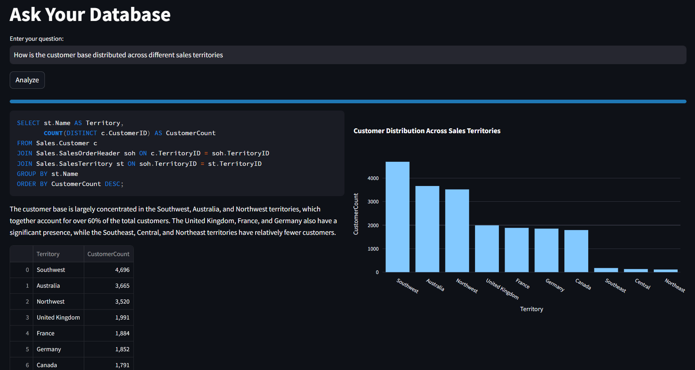

# Test to SQL using LLM

## Project Overview

This project is inspired by **[Text-to-SQL blog post by Pinterest](https://medium.com/pinterest-engineering/how-we-built-text-to-sql-at-pinterest-30bad30dabff)** that details their approach to integrating large language models (LLMs) with vector search technologies for enhancing database interactions. Motivated by the elegance of their solution, this project is an attempt to reproduce and explore similar capabilities, specifically designed for text to SQL generation using the AdventureWorks database.

The system is configured to work with the AdventureWorks database, a complex schema that supports a wide range of queries from simple data retrieval to complex joins and aggregations. It dynamically handles any new valid questions related to the database schema, performing complex join operations between multiple tables. Furthermore, it validates SQL queries to ensure accuracy and compliance with SQL standards. Upon generating the SQL, the system can rephrase the query results into a more understandable format and visually represent data insights through interactive Plotly charts.

Below is a detailed explanation of the architectural diagram included in this repository:


1. **User Question Input**: The entry point where users input their natural language queries.
2. **Query Question Collection**: This component utilizes vector search to identify relevant previously asked questions that align with the user's input.
3. **Query Schema Collection**: Retrieves schema information that corresponds to the user's query to ensure generated SQL queries are contextually appropriate.
4. **SQL Queries and Schema Information Retrieval**: Extracts necessary SQL queries and schema details from the database to aid in accurate SQL generation.
5. **Generate Prompt**: Constructs a detailed prompt from the retrieved information for the LLM.
6. **LLM using Groq API**: Processes the comprehensive prompt to generate precise SQL queries.
7. **SQL Server Query Generation**: Outputs the SQL query tailored to the user's request for execution.
8. **Results Processing & Visualization**: Manages the execution of SQL queries and visualizes the results through data frames and Plotly charts, displayed using Streamlit.
9. **Vector Database Initialization**: Involves the initial setup of the vector database, which is required only once to facilitate the querying process.


## Installation

Follow these steps to get started with the AI SQL Architect:

1. Clone the repository:
2. Navigate to the project directory:
3. Install the required dependencies:


### Initial Setup

**Vector Database Initialization**: Run the `vector.py` script a single time to initialize and populate the vector database. This setup is crucial for the project's search capabilities:

```bash
python vector.py
```

## Usage

To run the application, use the following command:

```bash
streamlit run app.py
```

This command launches the Streamlit interface in your browser where you can input queries and view SQL results along with visual data representations.

## Results
### 1) What is the total freight cost for each shipping method


### 2) Who are the top 5 salespeople by total sales amount?


### 3) Give the full names of top 5 customers responsible for the highest sales?


### 4) How is the customer base distributed across different sales territories



### 5) How many sales orders are there per sales territory?

